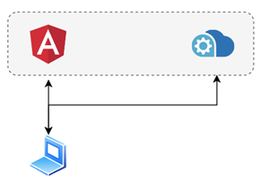
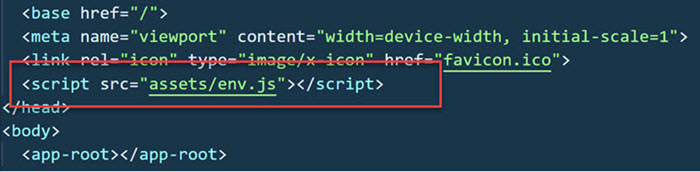
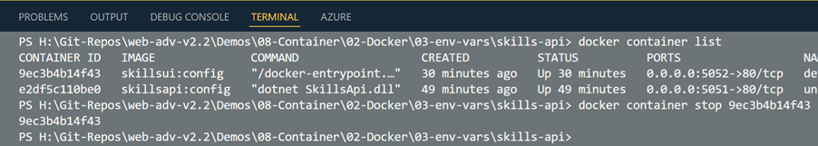

# Inject Config using environment variables



Skills Api: 

```bash
# Build Image
docker build --rm -f "Dockerfile" -t skillsapi:config .
# Publish img to docker hub - requires account and login
docker tag skillsapi:config arambazamba/skillsapi:config
docker push arambazamba/skillsapi:config
# Run Image
docker run -d --rm -p 5051:80 skillsapi:config
# List running contaienrs
docker container list
# Browse using http://localhost:5051/skills
```

Skills UI:

Open project `skills-ui` and examine `./src/assets` and `./src/environments`

`env.js` is referenced in `index.html`:
```typescript
(function (window) {
  window["env"] = window["env"] || {};
  window["env"].API_URL = "http://localhost:5001/skills";
})(this);
```

`environment.ts` references `window['env']`-variables:
```typescript
declare global {
  interface Window {
    env: any;
  }
}

export const environment = {
  production: false,
  apiUrl: window['env'].API_URL,
};
```

`dockerfile` calls `env.transform.js` to update `env.js` with current environment variables:

```bash
CMD ["/bin/sh", "-c", "envsubst < /usr/share/nginx/html/assets/env.template.js > `
    /usr/share/nginx/html/assets/env.js && exec nginx -g 'daemon off;'"]
```

`env.transform.js`:
```typescript
(function (window) {
  window["env"] = window["env"] || {};
  window["env"].API_URL = "${ENV_API_URL}";
})(this);
```

Update `index.html` to execute `env.js` to set the default env vars:



Build, Publish & start Image:

```bash
docker build --rm -f "dockerfile" -t skillsui:config .
# Publish img to docker hub - requires account and login
docker tag skillsui:config arambazamba/skillsui:config
docker push arambazamba/skillsui:config
# Test 
docker run -d --rm -p 5052:80 --env ENV_API_URL="http://localhost:5051/skills" skillsui:config
```

Browse using http://localhost:5052 and go to route /skills. This is working because the api is consumed using port forwarding.

List Containers and stop them:

```
docker container list 
docker container stop 9ec3b4b14f43
docker container stop e2df5c110be0
```


